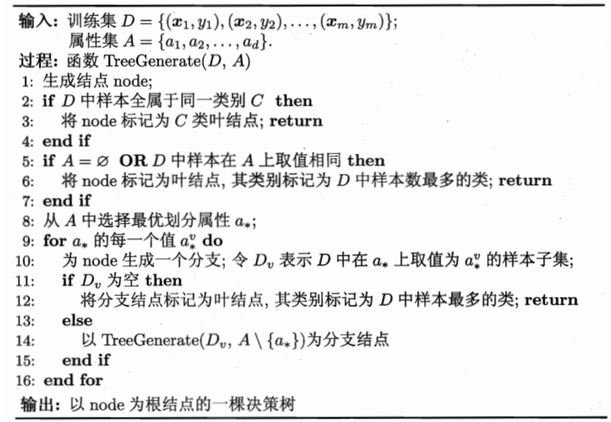
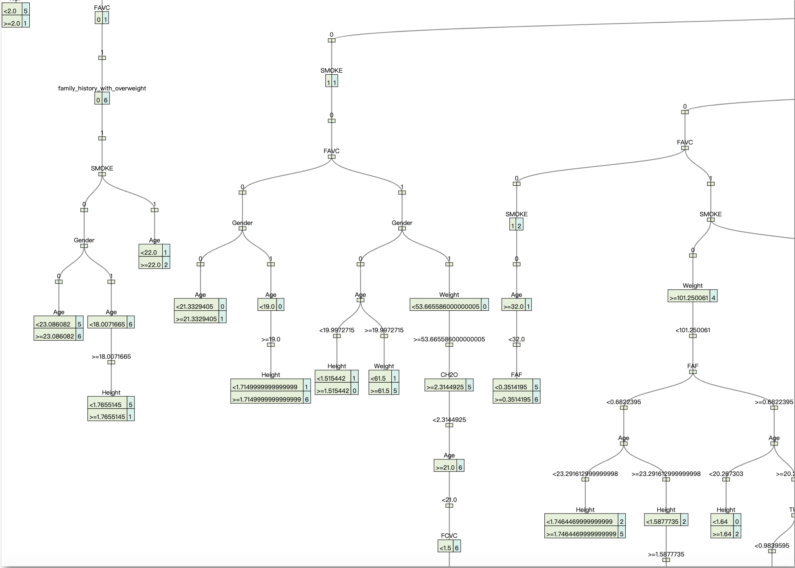
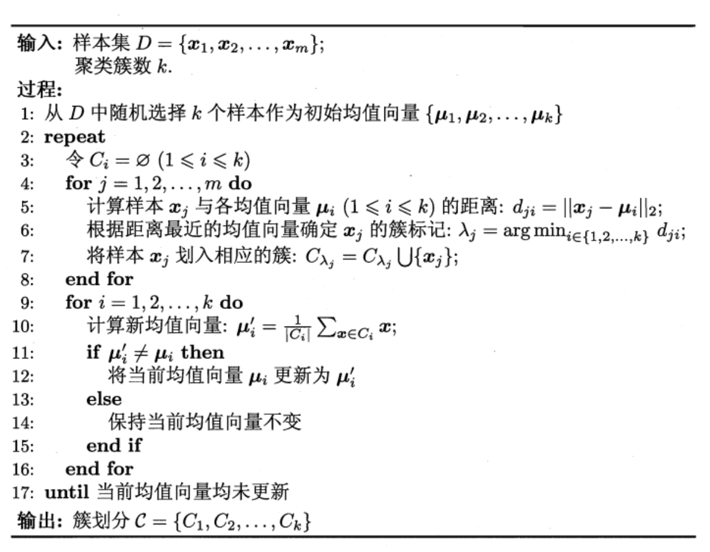
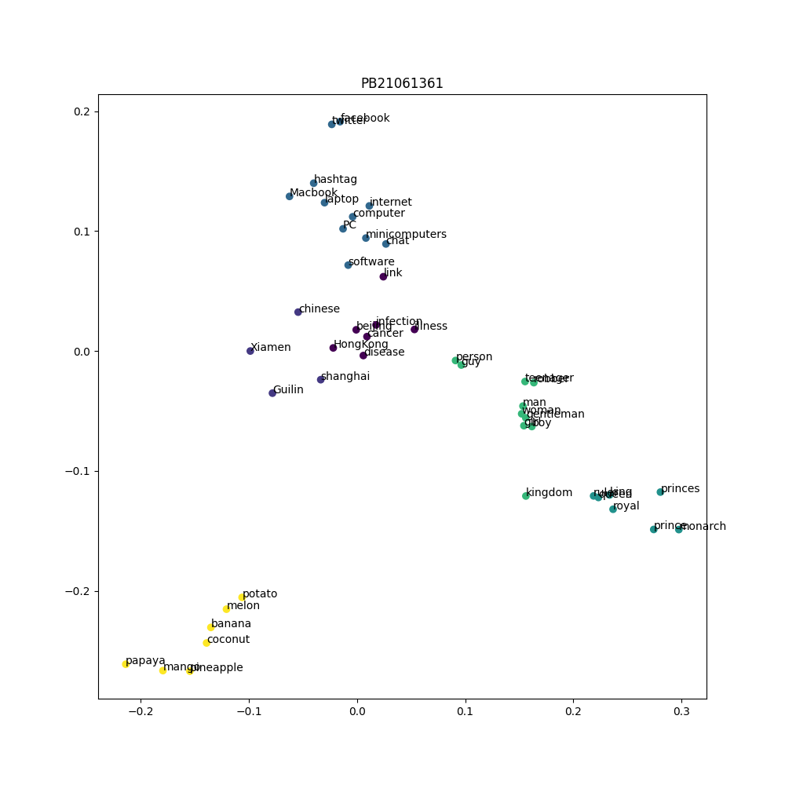
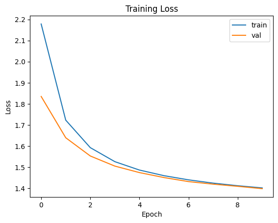

# Lab2实验报告
## Part1
### 决策树
本次实验所用到的决策树参考西瓜书上的普通决策树。

根据算法的伪代码，

当某个结点的所有标签y不可被分，则返回y；若特征不可被分，则返回最多的类y，记为叶子结点。
```py
if len(np.unique(y)) == 1:
    # print('y cannot be split')
    return y[0]

# if X cannot be split
if X.shape[1] == 1 or X.duplicated(keep=False).all() or X.shape[0] < 2:
    # print('X cannot be split')
    return np.argmax(np.bincount(y))
```
随后，对当前节点进行分类，选择最优的特征进行分类，计算信息增益，选择信息增益最大的特征进行分类。

对于离散值的信息增益计算，直接使用$$ H(D) = -\sum_{k=1}^{K} \frac{|C_k|}{|D|} \log_2 \frac{|C_k|}{|D|} $$即可。对于连续值时，需要先对当前连续值的可能值进行排序，然后选择两两的中心（设有 $k$ 个），则有 $k-1$ 个划分点，对于每个划分点，分为两类后各自计算信息增益，选择信息增益最大的划分点作为最优划分点。

随后用一个字典存储当前节点的分类信息。
```py
bestFeature, _, float_indicator, float_split = self._getBestFeature(X, y)

tree = {bestFeature: {}}
        
# Generate child
if float_indicator:
    less_index = np.where(X[bestFeature] < float_split)
    greater_index = np.where(X[bestFeature] >= float_split)
    tree[bestFeature]['<{}'.format(float_split)] = self.fit(X[X[bestFeature] < float_split].drop(columns=[bestFeature]), y[less_index])
    tree[bestFeature]['>={}'.format(float_split)] = self.fit(X[X[bestFeature] >= float_split].drop(columns=[bestFeature]), y[greater_index])
else:
    for value in range(self.discrete_features_size[bestFeature]):
        index = np.where(X[bestFeature] == value)
        if len(index[0]) == 0:
            tree[bestFeature][value] = np.argmax(np.bincount(y))
            continue
        else:
            split_X = X[X[bestFeature] == value].drop(columns=[bestFeature])
            tree[bestFeature][value] = self.fit(split_X, y[index])
return tree
```

最后预测时，根据构建好的决策树进行预测。对于离散值，直接根据特征值进行分类；对于连续值，根据划分点进行分类。

由于测试集中可能存在某一节点的离散值和训练集中的离散值不同，且不存在对应的划分，因此需要对于未出现的特征值进行处理，这里采用了该特征值最大的可能（即最多出现的类）进行分类，并计算这种情况的次数。计算时采用深度优先遍历当前节点下可能出现的最大的类。
```py
feature = list(tree.keys())[0]
value = x[feature]
if feature in self.continous_features:
    compare = list(tree[feature].keys())[0].split('<')[1] # '<0.5' -> '0.5'
    if value < float(compare):
        if type(tree[feature]['<{}'.format(compare)]) != dict:
            return tree[feature]['<{}'.format(compare)]
        else:
            return self._singlePredict(x, tree[feature]['<{}'.format(compare)])
    else:
        if type(tree[feature]['>={}'.format(compare)]) != dict:
            return tree[feature]['>={}'.format(compare)]
        else:
            return self._singlePredict(x, tree[feature]['>={}'.format(compare)])
else:
    query = tree[feature].get(value, None)
    if not query:
        self.misscount += 1
        # search all the keys in the tree, find the biggest probability
        return self._getBiggestProb(tree[feature])
    if type(tree[feature][value]) != dict:
        return tree[feature][value]
    else:
        return self._singlePredict(x, tree[feature][value])


def _getBiggestProb(self, tree):
        counts = dict()
        def dfs(tree):
            for key, value in tree.items():
                if type(value) == dict:
                    dfs(value)
                else:
                    counts[value] = counts.get(value, 0) + 1 
        
        dfs(tree)
        return max(counts, key=counts.get) # return the key with the biggest value
```
随后进行测试，得到测试集上的准确率和miss的次数。
```
0.8392434988179669 
6
```
这里将决策树输出到`json`文件中，利用在线json编译成树查看，可以查看到决策树的全貌。

#### 总结
本次只采用了十分传统的决策树，对于信息缺失和过拟合现象实际上有更好的算法，比如CART，ID3等。迫于时间原因，本次实验只实现了最基硖的决策树算法，因而准确率仍有可以提升的空间。

### PCA和KMeans
PCA和KMeans能够对数据进行降维和聚类。对于PCA，由于数据是较高维度的，且可能不能线性可分，若直接采用传统的PCA，降维到2维后，数据的距离信息将会丢失非常多。因此需要对数据点进行核化，转化到高维特征空间后，再使用PCA对特征空间进行降维。

核函数的选择有很多，这里采用了高斯核函数，高斯核对于高维数据中的距离信息的保留较好。高斯核函数的定义是
$$ K(x, z) = \exp(-\frac{||x-z||^2}{2\sigma^2}) $$

```py
"rbf": lambda x, y: np.exp(-np.linalg.norm(x - y) ** 2 / 100), # Gaussian kernel

def _computerKernelMatrix(self, X:np.ndarray, kernel):
    # X: [n_samples, n_features]
    n_samples = X.shape[0]
    kenerl_matrix = np.zeros((n_samples, n_samples))
    for i in range(n_samples):
        for j in range(n_samples):
            kenerl_matrix[i, j] = kernel(X[i], X[j])
    return kenerl_matrix
```
对于一组数据，计算核矩阵后，需要对核矩阵进行中心化。一种中心化方法是
$$K_c = K - \mathbf{1}K - K\mathbf{1} + \mathbf{1} K \mathbf {1} $$
其中 $$ \mathbf{1} = \frac{1}{N} I $$N是点的个数，I是单位矩阵。

核化后，计算特征值和特征向量，对特征向量进行排序，取前k(=2)个特征向量，得到主成分。
```py
def fit(self, X:np.ndarray):
        # X: [n_samples, n_features]
        # TODO: implement PCA algorithm
        # centralize the data
        kenerl_matrix = self._computerKernelMatrix(X, self.kernel_f)
        draw = PicPoints().to_mtrx(kenerl_matrix)
        K_centered = self._computeKernelCentered(kenerl_matrix)
        
        eigenvalues, eigenvectors = np.linalg.eig(K_centered)
        idx = eigenvalues.argsort()[::-1]
        eigenvalues = eigenvalues[idx][:self.n_components]
        eigenvectors = eigenvectors[:, idx][:, :self.n_components]
        
        # reduction matrix
        return eigenvalues, eigenvectors, kenerl_matrix
```
随后，对核矩阵进行变换，得到降维后的数据，即
$$ X = KA/\sqrt{V} $$
其中$A$是特征向量，$V$是对应特征值。除法按列操作。最后X即为降维后的点。

现在对降维后的点进行传统的KMeans处理。定义类的个数至多为7个。根据算法

初始化类中心后，对于每个点，计算到每个类中心的距离，选择最近的类中心，将点归类到该类中心。随后更新类中心，直到类中心不再变化或达到最大迭代数。

```py
 def assign_points(self, points):
        # points: (n_samples, n_dims,)
        # return labels: (n_samples, )
        n_samples, n_dims = points.shape
        self.labels = np.zeros(n_samples)
        # TODO: Compute the distance between each point and each center
        # and Assign each point to the closest center
        for i in range(n_samples):
            self.labels[i] = np.argmin(np.linalg.norm(self.centers - points[i], axis=1)) # L2 norm
        return self.labels

    # Update the centers based on the new assignment of points
    def update_centers(self, points):
        # points: (n_samples, n_dims,)
        # TODO: Update the centers based on the new assignment of points
        for k in range(self.k):
            clusters = points[self.labels == k]
            if len(clusters) > 0:
                self.centers[k] = clusters.mean(axis=0)
        pass

    # k-means clustering
    def fit(self, points):
        # points: (n_samples, n_dims,)
        # TODO: Implement k-means clustering
        while self.max_iter > 0:
            old = self.centers.copy()
            self.assign_points(points)
            self.update_centers(points)
            self.max_iter -= 1
            if np.all(old == self.centers):
                break
        pass
```
可以得到分类的数据。
传统的KMeans的缺点包括极易收到初始选择点的影响。因此可能分类结果会随着初始选择点变化而变化，导致分类效果不佳。

## Part2
### Transformer
本次实验实现了一个简单的Transformer模型，包括了Encoder和Decoder。随后使用MoE（Mixture of Experts）对Transformer进行改进。

首先需要对toke进行tokenized. 
```py
def generate_vocabulary(self):
        self.char2index = {}
        self.index2char = {}
        """
        TODO:
        """
        unique_chars = sorted(set(self.dataset))
        self.char2index = {char: index for index, char in enumerate(unique_chars)}
        self.index2char = {index: char for index, char in enumerate(unique_chars)}
```
随后在该表上，实现encode和decode。
```py
class Tokenizer:
    def __init__(
        self,
        dataPath:str
        ):
        with open(dataPath,"r",encoding="utf-8") as f:
            self.dataset = f.read()
        self.generate_vocabulary()

    def generate_vocabulary(self):
        self.char2index = {}
        self.index2char = {}
        """
        TODO:
        """
        unique_chars = sorted(set(self.dataset))
        self.char2index = {char: index for index, char in enumerate(unique_chars)}
        self.index2char = {index: char for index, char in enumerate(unique_chars)}
        
        

    def encode(
        self,
        sentence : str,
        ) -> torch.Tensor:
        """
        TODO:
        例子, 假设A-Z 对应的token是1-26, 句子开始，结束符号的token是0。
        input  : "ABCD"
        output : Tensor([0,1,2,3]) 

        注意: 为了后续实验方便，输出Tensor的数据类型dtype 为torch.long。
        """
        tokens = []
        for char in sentence:
            tokens.append(self.char2index[char])
        return torch.tensor(tokens, dtype=torch.long)
        

    def decode(
        self,
        tokens : torch.Tensor,
        ) -> str:
        # 去掉开始和结束标记    
        indices = tokens[1:-1]
        # 转换为字符
        chars = [self.index2char[index] for index in indices]
        return "".join(chars)
```
随后定义好Dataset和Dataloader，开始实现注意力模块。注意力模块中有$Q,K,V$三个矩阵，传统的方法计算后得到注意力分数为
$$ Attention = softmax(\frac{QK^T}{\sqrt{d_k}})V $$
其中$\sqrt{d_k}$设置为embed_size，目的是为了防止点积过大，实际意义是通过缩放因子控制softmax对于点积的敏感度。

随后计算mask并应用到点积上，mask的作用是对于某些位置的值进行屏蔽，不参与计算。最后与权值矩阵相乘，得到输出。
```py
# 计算Q,K,V
query = self.to_q(inputs)
key = self.to_q(inputs)
value = self.to_q(inputs)

# 计算注意力的分数
attention = torch.bmm(query, key.transpose(1, 2)) / (embed_size ** 0.5) 

# mask
mask = self.tril[:seq_len, :seq_len].unsqueeze(0) # (1, seq_len, seq_len)
attention = attention.masked_fill(mask == 0, float('-inf'))

# softmax
attention = F.softmax(attention, dim=-1)

output = torch.bmm(attention, value).to(device)
return output
```
随后在单头注意力的基础上，实现多头注意力。多头注意力即是将多个单头的注意力矩阵拼接。
```py
self.heads = nn.ModuleList(
    [HeadAttention(seq_len, embed_size, head_size) for _ in range(n_heads)]
)

self.projection = nn.Linear(n_heads * head_size, embed_size)

def forward(self, inputs):
    # 每个head attention
    head_outputs = [head(inputs) for head in self.heads]
    concat_output = torch.cat(head_outputs, dim=-1)
    output = self.projection(concat_output).to(device)
    return output
```
随后实现Expert模块，Expert模块是一个简单的全连接层。这里使用xavier unifrom初始化。中间使用ReLU作为激活函数。
```py
self.linear1 = nn.Linear(embed_size, embed_size * 4)
self.linear2 = nn.Linear(embed_size * 4, embed_size)
nn.init.xavier_uniform_(self.linear1.weight)
nn.init.xavier_uniform_(self.linear2.weight) # 初始化权重

def forward(self, inputs):
    # inputs: (batch_size, seq_len, embed_size)
    # -> mid: (batch_size, seq_len, 4 x embed_size)
    # -> outputs: (batch_size, seq_len, embed_size)
    output = F.relu(self.linear1(inputs))
    output = self.linear2(output).to(device)
    return output
```
随后计算TopkRouter，TopkRouter是一个简单的全连接层，目的是选择出需要参与计算的Expert。首先通过多层感知机计算出每个Expert的分数，计算好前k个Expert的位置后，对不需要对应的Expert进行mask，值为$-\infty$。最后使用softmax使分值为[0,1]区间上的数，且总和为1.
```py
self.mlp = nn.Sequential(
    nn.Linear(embed_size, embed_size * 4),
    nn.ReLU(),
    nn.Linear(embed_size * 4, num_experts)
)

def forward(self, inputs):
    score = self.mlp(inputs)
    topk_indices = torch.topk(score, self.active_experts, dim=-1).indices
    
    masked_score = torch.zeros_like(score, dtype=torch.bool)
    masked_score.scatter_(dim=-1, index=topk_indices, value=True)
    score = score.masked_fill(~masked_score, float('-inf'))
    
    router_output = F.softmax(score, dim=-1).to(device)
    indices = topk_indices
    return router_output, indices
```
随后在此基础上，建立稀疏Expert模块。稀疏Expert模块是将多个Expert的输出进行拼接，得到新的embedding。在最开始实现时，使用非常传统的循环计算，导致计算花销非常之高。计算一个iteration需要花费大约10s。对于一个epoch，`batch_size=512`时，大约需要1800个iteration，因此需要花费大约11-12个小时。这是不可接受的。因此需要对代码进行优化。

huggingface中有对moe进行详细解释，遂参考huggingface的原理进行实现。

首先，在得到了expert分数和expert选择器后，对input和expert分数进行reshape，使其只关注embedding维度。
```py
# Reshape input
flat_inputs = inputs.view(-1, inputs.size(-1)) # (batch_size * seq_len, embed_size)
flat_router_output = router_output.view(-1, router_output.size(-1)) # (batch_size * seq_len, num_experts)
```
随后，对于每个Expert，创建一个Mask，表示当前的expert是否被embeddiing选择了。
```py
# 创建mask
expert_mask = (indices == i).any(dim=-1) # (batch_size, seq_len)
flat_mask = expert_mask.view(-1) # (batch_size * seq_len)
```
如果被选择，则计算expert的输出，并将expert的输出与对应的分数权重相乘，加到最终的输出上。
```py
if flat_mask.any():
    expert_input = flat_inputs[flat_mask]
    expert_output = expert(expert_input)
    
    gating_scores = flat_router_output[flat_mask, i].unsqueeze(1)
    weighted_expert_output = expert_output * gating_scores
    
    final_output[expert_mask] += weighted_expert_output.squeeze(1)
```
通过这样的计算，可以非常快速地得到结果。在优化后，一个iteration花费的时间大大降低，约为0.1s。因此一个epoch大约需要3分钟。

最后，使用`nn.LayerNorm`对输出进行归一化，然后封装一个Transformer层。
```py
self.ln1 = nn.LayerNorm(embed_size)
self.ln2 = nn.LayerNorm(embed_size)
self.mha = MultiHeadAttention(n_heads, embed_size//n_heads, seq_len, embed_size)
self.moe = SparseMoE(embed_size, num_experts, active_experts)

def forward(self, inputs):
    # input: (batch_size, seq_len, embed_size)
    #TODO: forward with residual connection
    
    x = self.ln1(inputs)
    x = self.mha(x) + x
    x = self.ln2(x)
    x = self.moe(x) + x
    return x
```

随后从token开始实现`num_layer`层个Transformer，打包成一个模型。
```py
 # inputs:(batch_size, seq_len, )
batch_size, seq_len, = inputs.shape
# embedding:(batch_size, seq_len, embed_size)

embedding = self.token_embedding(inputs) + self.position_embedding(torch.arange(seq_len, device=device))

# attens:(batch_size, seq_len, embed_size)
for block in self.blocks:
    attens = block(embedding)

# logits:(batch_size, seq_len, vocab_size)

logits = self.output_linear(self.layernorm(attens))
```
最后，定义训练模型。将输入传入模型，得到输出，与目标输出计算Loss后，将loss反向传播对模型参数进行更新。
```py
inputs, targets = inputs.to(device), targets.to(device)
inputs = inputs.clone().detach()
targets = targets.clone().detach()
optimizer.zero_grad()

logits, loss = model(inputs, targets)
loss.backward()
optimizer.step()
total_loss += loss.item()
```
随后训练模型，并将loss曲线绘制出来。

选择`batch_size=512`，训练10个epoch，每个epoch大概花费90秒。得到的loss曲线如下。
此时模型可能并未收敛。最后得到的句子预测为
```
I could pick my lance
That I will be so my lord.

PETRUCHIO:
The shall I shall be so man a son a man a sincent to the sea
```
看起来十分滑稽且没有逻辑。这可能是因为模型并未收敛。翻译成中文是：
```
我可以拿起我的长枪
我将成为我的主。

彼得鲁奇奥：
我必成为这样的人，一个儿子，一个有罪的人
```

### GCG攻击
GCG攻击是一种生成对抗样本的方法。GCG攻击的原理是通过梯度下降，使得生成的样本尽可能地接近目标样本，同时尽可能地远离原样本。这样生成的样本就是对抗样本。通过对抗样本的生成，输入到模型中，可以使得模型可能产生不好的输出。

这里参考了GCG原论文仓库中的代码实现。

首先定义one_hot，这里的词表大小即embed_weights的第一个维度。随后置one_hot中对应token的位置为1，并使其参与梯度计算。
```py
one_hot = torch.zeros(
        input_ids[input_slice].shape[0], embed_weights.shape[0],
        device = device,
        dtype = embed_weights.dtype
    )
one_hot = one_hot.scatter_(
        1,
        input_ids[input_slice].unsqueeze(1),
        torch.ones(
            input_ids[input_slice].shape[0], 1,
            device = device,
            dtype = embed_weights.dtype
        )
    )
    one_hot.requires_grad_(True)
```
随后one_hot乘以embedding矩阵，得到input_slice的embedding。将input_embeds替换embedding的对应部分。
```py
# TODO: 3. 将 one_hot 乘以 embedding 矩阵，得到 input_slice 的 embedding，注意我们需要梯度
    input_embeds = (one_hot @ embed_weights).unsqueeze(0) # (1, input_slice_len, hidden_size)

    embeds = get_embeddings(model, input_ids.unsqueeze(0)).detach()

    #TODO: 4. 用 input_embeds 替换 embedding 的对应部分（可以拼接），拿到 logits 之后和 target 进行 loss 计算

    full_embeds = torch.cat(
        [
            embeds[:,:input_slice.start,:],
            input_embeds,
            embeds[:, input_slice.stop:, :]
        ],
        dim=1
    )
    logits = model(inputs_embeds=full_embeds).logits
    targets = input_ids[target_slice]
    loss = nn.CrossEntropyLoss()(logits[0, loss_slice, :], targets)
```
得到梯度后，对one_hot进行更新，使得生成的对抗样本尽可能地接近目标样本。
```py
# TODO: 重复 batch_size 次（随机采样的次数） -> (batch_size, len(control_toks))
original_control_toks = control_toks.repeat(batch_size, 1)

# TODO: 生成 batch_size 个新的 token 位置作为采样的位置，允许复选
new_token_pos = torch.arange(0, len(control_toks), len(control_toks) / batch_size, device=grad.device)
new_token_pos = new_token_pos.type(torch.int64)

# TODO: 利用梯度的 topk 来获取每个 token 位置上梯度最大的 topk 个 token 的索引
# https://pytorch.org/docs/stable/generated/torch.topk.html
top_indices = (-grad).topk(topk, dim=-1).indices

# TODO: 从 top_indices 中的 new_token_pos （作为 index）随机采样一个 topk token 的索引，作为新的 token
new_token_val = torch.gather(
    top_indices[new_token_pos],
    1,
    torch.randint(0, topk, (batch_size, 1), device=grad.device)
)

# TODO: 得到新的 control tokens
new_control_toks = original_control_toks.scatter_(1, new_token_pos.unsqueeze(-1), new_token_val)
```